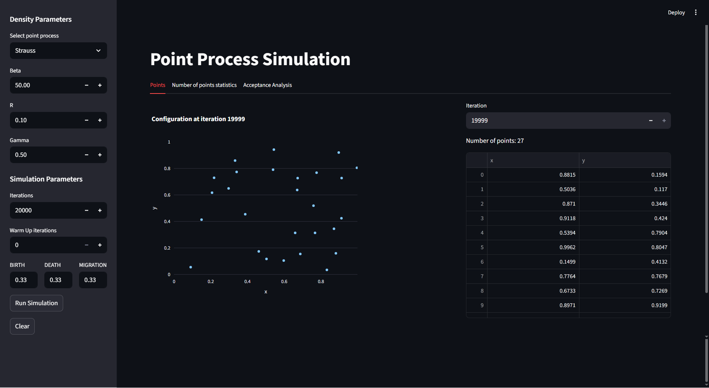
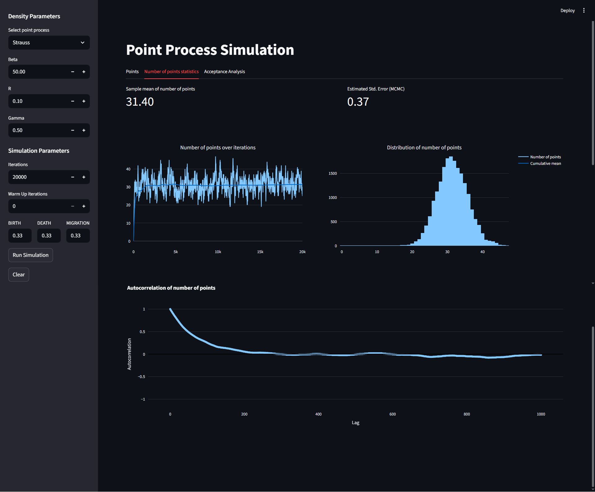
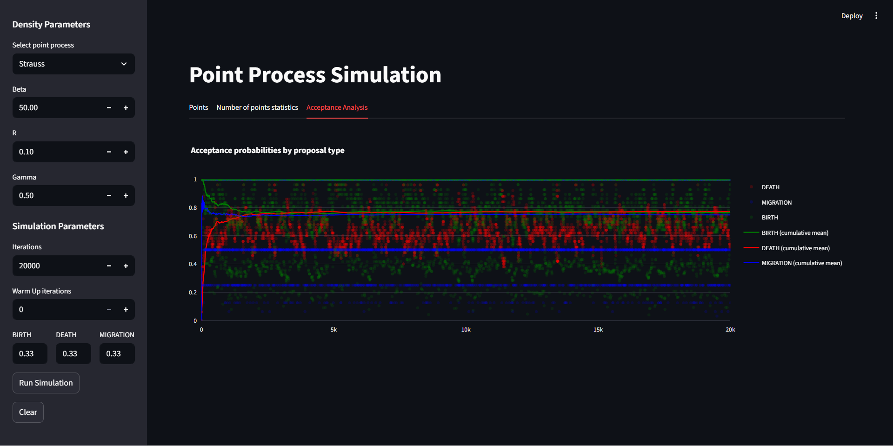

# Point Process Simulation Dashboard

An interactive web application for simulating and analyzing spatial point processes using Markov Chain Monte Carlo (MCMC) methods with Birth-Death-Migration algorithms.

## 📸 Screenshots

### Simulated Configurations


### Number of Points Statistics


### MCMC Metrics



## Overview

Implements several spatial point process densities (Poisson, Strauss, Saturated, Hardcore) and a Birth-Death-Move MCMC sampler. The interactive dashboard allows users to:

- Configure point process parameters
- Run MCMC simulations with customizable chain length and burn-in periods
- Visualize spatial configurations
- Analyze convergence properties through acceptance rates and autocorrelation functions

## Installation

### Prerequisites
- [pip](https://pip.pypa.io/) or [uv](https://github.com/astral-sh/uv) package manager

### Using uv (Recommended)

```bash
# Install uv if you haven't already
pip install uv
# Create a virtual environment
uv venv
source .venv/bin/activate  # On Windows: .venv\Scripts\activate

# Install the project in editable (development) mode
uv pip install -e .
```

### Using pip
```bash
# Create a virtual environment
python -m venv .venv
source .venv/bin/activate  # On Windows: .venv\Scripts\activate

# Install the project in editable (development) mode
pip install -e .
```

## Usage

### Launch the Web Application
```bash
streamlit run scripts/app.py
```
The application will open in your default web browser at `http://localhost:8501`.

## Core Components

### `src/samplers/bdm.py` - MCMC Engine
- `BirthDeathMigration`: Main MCMC simulator class
- `HistoryTracker`: Simulation history logging
- `ConfigEvaluator`: Real-time metric computation

### `src/densities/` — Point Process Models
- Contains all implemented point process densities (e.g. **Strauss**, **Poisson**, **Hardcore**, **Saturated Strauss**)
- Each density is implemented as a class extending a common base interface

### `scripts/app.py` - Web Interface
- Streamlit-based interactive dashboard
- Statistical analysis dashboard

### `scripts/performance_tester.py` — Performance Profiler
- Script for running and storing **cProfile** results of the BDM algorithm
- Helps identify performance bottlenecks and benchmark optimizations
- 
## Configuration

### Point Process Parameters
- **R (Interaction Radius)**: Distance threshold for point interactions (0.0 - 2.0)
  - *Note: Values > √2 ≈ 1.41 may have limited effect due to unit square geometry*
- **β (Intensity)**: Base intensity parameter controlling point density (1.0 - 500.0)  
- **γ (Interaction Strength)**: Repulsion strength between nearby points (0.0 - 1.0)
  - γ = 0: Complete inhibition (hardcore process)
  - γ = 1: No interaction (Poisson process)
- **s (Saturation)**: Maximum number of neighbors contributing to interaction


*All simulations are constrained to the unit square [0,1]² spatial domain.*

### MCMC Parameters
- **Iterations**: Number of MCMC steps after burn-in
- **Warm-up**: Burn-in period to reach equilibrium
- **Move Probabilities**: Relative frequencies of birth/death/migration moves

## Development

### Adding New Point Processes
1. Implement the new density class in `src/densities/` (create a new file if needed, or add to an existing one).
2. Add parameter controls in `app.py`.
3. Update visualization methods as needed.
## Support

For questions, issues, or contributions, please open an issue on the project repository.
